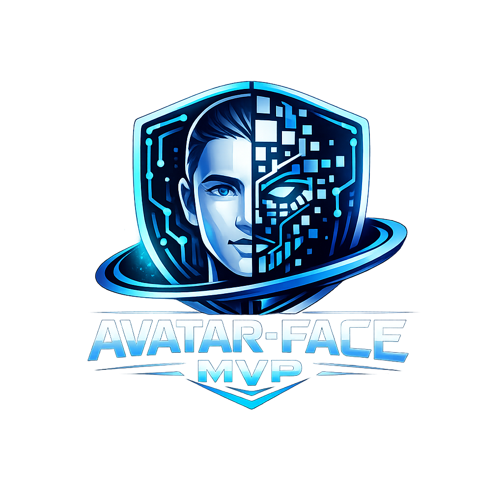

<p align="center">
  
</p>

[](https://mcp-tool-shop-org.github.io/avatar-face-mvp/)

**プロトタイプ:** 実用化されたソフトウェアではなく、コンセプト実証のためのものです。
実際のリリースに至るまでに必要なことについては、[v0.1.0 までのロードマップ](#roadmap-to-v010) をご確認ください。

リアルタイムでのVRMアバターの口の動きの同期、表情、待機アニメーション、およびテキスト読み上げ機能。Godot 4.3以降のバージョンで構築されており、音声合成のためにNode.jsのブリッジを使用しています。

## これは何を証明するのか

1. **マイク入力 -> 顔の動きがリアルに再現**。60fpsで、遅延ゼロのFFTによる口の動きを反映します。
2. **ウェブカメラ入力 -> OpenSeeFaceによるフル顔トラッキング** (52種類のARKitブレンドシェイプに対応)。
3. **テキスト入力 -> アバターが発話**。KokoroSharpによる、口の動きに合わせたテキスト読み上げ（TTS）機能。
4. **任意のCC0ライセンスのVRMモデルをダウンロード -> 自動的に設定が適用され、すぐに利用可能**。
5. **全てデータ駆動型**。コードの変更ではなく、マッピング用のJSONファイルを置き換えることで調整が可能です。

## 状態

| 特徴 | 状態 |
| Please provide the English text you would like me to translate. I am ready to translate it into Japanese. | 以下に翻訳します。
-------- |
| FFTを用いた視覚情報に基づく口の動きの同期 (マイク/WAV形式)。 | 作業中。 |
| OpenSeeFaceによるウェブカメラ追跡機能。 | 作業中。 |
| コンテキストを考慮した、手続き的な点滅。 | 作業中。 |
| 待機時のアニメーション（呼吸、揺れ、頭の動き）。 | 作業中。 |
| 微小な眼球運動を伴う視線。 | 作業中。 |
| 表情の構成要素（まばたき > 視線 > 口の動き > 表情）。 | 作業中。 |
| TTS（テキスト読み上げ）ブリッジ + 音声合成機能。 | 作業中。 |
| パフォーマンスに関する追加情報（TTSによる感情表現）。 | 作業中。 |
| BridgeManager 自動接続機能。 | 作業中。 |
| アバターライブラリ（CC0ライセンスのVRMモデルを閲覧・ダウンロードできます）。 | 作業中。 |
| モデル診断パネル | 作業中。 |
| VRM、ARKit、VRChatに対応したプロファイル設定。 | 作業中。 |
| ホットリロードに対応した設定ファイル（tuning.json、mapping.json）。 | 作業中。 |
| T字姿勢からA字姿勢への腕の調整。 | **エラー:** 作業中であり、正しい結果が得られていません。 |

## スタック

- **動作環境:** Godot 4.3 以降 (GL互換レンダラー)
- **アバター形式:** VRM 0.0 および 1.0 (vendoredされた [godot-vrm](https://github.com/V-Sekai/godot-vrm) アドオン経由)
- **FFTドライバ:** 組み込みの `AudioEffectSpectrumAnalyzer` -> 5つのビゼームバンド
- **ウェブカメラドライバ:** [OpenSeeFace](https://github.com/emilianavt/OpenSeeFace) UDP (52個のARKitブレンドシェイプ + ヘッドポーズ)
- **TTSブリッジ:** Node.js WebSocket リレーで Godot と [voice-soundboard-mcp](https://github.com/mcp-tool-shop-org/voice-soundboard-mcp) を接続 + オプションで [mcp-aside](https://github.com/mcp-tool-shop-org/mcp-aside) を使用して表情の指示
- **TTSエンジン:** KokoroSharp (ローカルで動作、GPUまたはCPUを使用)
- **設定:** データ駆動型のJSON形式で、2秒間のホットリロードに対応。

## セットアップ

### 前提条件

- Godot 4.3 以降 (OpenGL互換)
- Node.js 18 以降 (テキスト読み上げ機能連携用)
- VRM形式のアバターファイル (または、同梱されているテスト用アバター「Seed-san」を使用)

### クイックスタートガイド

```bash
# Clone
git clone https://github.com/mcp-tool-shop-org/avatar-face-mvp.git
cd avatar-face-mvp

# Install TTS bridge dependencies
cd tools/tts-bridge
npm install
cd ../..

# Open in Godot
# File -> Open Project -> select project.godot
# Press F5 to run
```

### 初回稼働

1. アプリは、`assets/avatars/` フォルダ内で最初に見つかったVRMファイルを読み込みます。
2. BridgeManagerは、自動的にTTS（テキスト読み上げ）ブリッジを起動し、接続します。
3. アバターがあなたの声に合わせて口の動きを同期させる様子を確認するには、**「マイク開始」**ボタンをクリックしてください。
4. または、**「テスト音声再生」**ボタンをクリックして、付属のテスト音声で動作を確認してください。

### マイクなしでの簡単なテスト

`assets/audio/test_vowels.wav` というテストファイルには、約10秒間で、すべての5つの発音単位（"ou", "oh", "aa", "ih", "ee"）がそれぞれ2回繰り返される音声が含まれています。FFTドライバが正常に動作しているかを確認するには、「テスト音声の再生」ボタンをクリックしてください。

テスト用音声ファイルを再生成するには、以下のコマンドを実行してください: `python tools/generate_test_audio.py`

### OpenSeeFace（ウェブカメラ追跡機能）の使用方法

1. [OpenSeeFace](https://github.com/emilianavt/OpenSeeFace)をインストールし、実行します。
2. デモUIで、デバイスの選択ドロップダウンメニューを「OpenSeeFace (Webcam)」に切り替えます。
3. トラッカーは、ARKitの52種類のブレンドシェイプと頭部の姿勢情報を、UDPプロトコルで`127.0.0.1:11573`宛に送信します。
4. `config/tuning.json`ファイル内の`openseeface`セクションで、ホスト名とポート番号を設定します。

### テキスト読み上げ機能の使用方法

このTTSシステムは、Node.jsのブリッジを使用して、Godotエンジンとローカルに設置されたKokoroSharpの音声合成サーバーを接続します。

1. `voice-soundboard-mcp` が実行されていることを確認してください（セットアップについては、そのリポジトリを参照してください）。
2. BridgeManager が自動的に `tools/tts-bridge/bridge.mjs` を起動し、接続を確立します。
3. 接続が確立されると、TTS パネルが自動的に開きます。テキストを入力して、**発話** ボタンをクリックしてください。
4. 利用可能な音声はサーバーから提供されます（デフォルト：`am_fenrir`）。
5. オプション：発話時に表現を豊かにするための感情を選択できます。

もし自動接続がうまくいかない場合は、TTSパネルにある「接続」ボタンを手動で操作してください。

## 操作方法

| 制御
管理
統制
支配
コントロール
制御する
管理する
統制する
支配する | その機能・役割. |
| 以下の文章を日本語に翻訳してください。 | 以下に翻訳します。
------------- |
| **Avatar dropdown** | ロードされているVRMモデルを切り替えます。 |
| **Driver dropdown** | FFT（マイク音声）またはOpenSeeFace（ウェブカメラ）。 |
| **Mapping profile dropdown** | VRM規格 / ARKit / VRChatにおけるブレンドシェイプのマッピング。 |
| **Start Mic** | FFTビゼムドライバ用のマイク入力を開始します。 |
| **Load WAV/OGG** | FFTドライバを通じて、カスタムの音声ファイルを再生します。 |
| **Play Test Vowels** | 同梱されているテスト音声を再生します。 |
| **Emotion dropdown + slider** | 表情（喜び、悲しみ、怒り、驚きなど）を手動で調整します。 |
| **Sensitivity slider** | FFT 振幅倍数 (1～30、デフォルト値: 8) |
| **Zoom +/-** | カメラのズーム機能（または、マウスホイール） |
| **Up / Down** | カメラの高さ調整。 |
| **Model Diagnostics** | 診断パネルの表示/非表示を切り替えます。 |
| **Avatar Library** | CC0ライセンスのVRMアバターを閲覧・ダウンロードできます。 |
| **TTS Speak** | TTSパネルの表示/非表示を切り替えます。 |

### TTSパネル

| 制御
管理
統制
支配
コントロール
制御する
管理する
統制する
支配する | その機能・役割. |
| 以下に翻訳します。
---------
Please provide the English text you would like me to translate. | 以下に翻訳します。
------------- |
| **Connect / Disconnect** | 手動でのブリッジ接続切り替えスイッチ。 |
| **Voice dropdown** | TTS（テキスト読み上げ）の音声を選択します（サーバーから自動的に取得されます）。 |
| **Emotion dropdown** | 会話中に、表情に関するヒントを取り入れる。 |
| **Text box** | アバターに発言させる内容を入力してください。 |
| **Speak** | 合成して再生する。 |
| **Stop** | 現在の再生を停止します。 |

### モデル診断パネル

ロードされたアバターの互換性情報をリアルタイムで表示します。

- **ステータス表示:** GREEN (すべてマッピング済み)、YELLOW (一部マッピング済み)、RED (重要な形状がマッピングされていない)
- **検出された形式:** VRM Standard、ARKit、またはVRChat
- **プロファイル推奨:** 正しいマッピングプロファイルを自動的に提案
- **ヴィーゼム対応状況:** ドライバーのヴィーゼムがどのブレンドシェイプにマッピングされているか (対応/未対応)
- **表情対応状況:** まばたきや感情についても同様
- **まばたき + 目のボーンの状態:** プロシージャルなまばたきやボーンに基づいた視線追跡が機能するかどうか
- **未マッピングのシェイプ:** モデル上のブレンドシェイプで、どのマッピングにも参照されていないもの

## 設定

### チューニング設定 (`config/tuning.json`)

2秒ごとに自動的に再読み込みされます。再起動は不要です。

| Key | その機能・役割. | デフォルト設定 |
|-----| 以下に翻訳します。
------------- | 以下に翻訳します。
---------
Please provide the English text you would like me to translate. |
| `smoothing.attack_time` | 重量が上昇する速度（秒）。 | 0.06 |
| `smoothing.release_time` | 重りが落下する速さ（秒）。 | 0.12 |
| `viseme_bands.*` | 可聴周波数範囲：各音素（viseme）に対して、最小値と最大値（単位：Hz）。 | ファイルを参照してください。 |
| `noise_gate` | 音声として認識されるための、最小のFFT（高速フーリエ変換）の振幅値。 | 0.01 |
| `sensitivity` | FFT 振幅倍増器 | 8.0 |
| `blink.*` | 手続き上のまばたきのタイミング（間隔、持続時間、二重まばたきの確率）。 | ファイルを参照してください。 |
| `openseeface.host` | OpenSeeFace UDP ホスト機能。 | 127.0.0.1 |
| `openseeface.port` | OpenSeeFaceのUDPポート。 | 11573 |

### マッピング設定ファイル (`config/mapping*.json`)

このプロジェクトには、以下の3つのプロファイルが付属しています。

| File | プロファイル名 | 対象機種： |
| Please provide the English text you would like me to translate. I am ready to translate it into Japanese. | 以下に翻訳します。
------------- | 以下に翻訳します。
-----------------
The company is committed to providing high-quality products and services.
（同社は、高品質な製品とサービスを提供することに尽力しています。）
----------------- |
| `mapping.json` | VRM規格 | `lip_a`: (唇に関連するデータ)
`blink_L`: (左目のまばたきに関連するデータ)
`face_happy`: (笑顔に関連するデータ) |
| `mapping_arkit.json` | ARKit | `jawOpen`: 口を開ける
`eyeBlink_L`: 左目を瞬く
`mouthSmile_L`: 左側の口角を上げる (または、左側の口角を微笑む) |
| `mapping_vrchat.json` | VRChat | `vrc_v_aa`, `vrc_blink` |

診断パネルは、読み込まれたモデルに最も適したプロファイルを自動的に検出し、切り替えを提案します。

## アーキテクチャ

```
                       +-- VisemeDriver (FFT bands -> 5 viseme weights)
mic / wav / tracker -->|
                       +-- OpenSeeFaceDriver (UDP -> ARKit blendshapes)
                            |
                            v
                       BlinkController (procedural, context-aware)
                            |
                            v
                       GazeController (micro-saccades, eye bone / blendshape)
                            |
                            v
                       ExpressionMapper (driver names -> VRM names, smoothing)
                            |
                            v
                       Expression Compositor (blinks > gaze > visemes > emotions)
                            |
                            v
                       MeshInstance3D.set_blend_shape_value()
                       IdleController.apply() (breathing, sway, head drift)

--- TTS pipeline (separate) ---

Godot TtsController <--WebSocket--> bridge.mjs <--MCP--> voice-soundboard-mcp
                                                 <--MCP--> mcp-aside (optional)
          |
          v
     AudioStreamPlayer (Capture bus -> FFT viseme driver -> lipsync)
     Performance cues -> AvatarController.set_expression_target()
```

### 主要な設計上の決定事項

- **すべてのホットパスで使用される辞書は、事前に割り当てられています**。これにより、フレームごとのガベージコレクションの負荷がゼロになります。
- **ブレンドシェイプの名前からインデックスへの対応付けは、アバターの読み込み時にキャッシュされます。**
- **デバッグUIの更新は、3フレームごとに1回に制限されます。**
- **設定ファイルのホットリロードのチェックは、フレームごとにではなく、2秒ごとに実行されます。**
- **BridgeManagerは、新しいプロセスを起動する前に、既にブリッジが動作しているかどうかを確認する「プロビスト」方式を採用しています。**
- **表情合成機能は、競合を解消します。例えば、まばたきは目の形状を抑制し、発音記号は口の表情を抑制し、顎の変形は制限されます。**

## プロジェクトの構成

```
avatar-face-mvp/
  project.godot
  config/
    mapping.json              # VRM Standard mapping profile
    mapping_arkit.json        # ARKit mapping profile
    mapping_vrchat.json       # VRChat mapping profile
    tuning.json               # FFT bands, smoothing, sensitivity, blink timing
  scripts/
    main.gd                   # Scene bootstrap, VRM loading, camera, bridge wiring
    avatar_controller.gd      # Master controller: drivers + mapper + compositor + mesh
    viseme_driver.gd          # FFT-based viseme extraction from AudioEffectSpectrumAnalyzer
    openseeface_driver.gd     # OpenSeeFace UDP client (52 ARKit blendshapes + head pose)
    blink_controller.gd       # Context-aware procedural blink (speech-suppressed, saccade-triggered)
    expression_mapper.gd      # Name mapping + asymmetric exponential smoothing + clamping
    idle_controller.gd        # Breathing, micro-sway, head drift, shoulder animation
    gaze_controller.gd        # Eye gaze: camera / wander / cursor modes, micro-saccades
    config_loader.gd          # JSON config with hot-reload + profile scanning
    demo_ui.gd                # UI harness (all panels, diagnostics, library, TTS)
    bridge_manager.gd         # TTS bridge auto-spawn + WebSocket probe with backoff
    tts_controller.gd         # WebSocket TTS client (speak, dialogue, stop, voices, aside cues)
    pose_corrector.gd         # T-pose -> A-pose arm correction (WIP, not working)
    vrm_runtime_loader.gd     # Runtime VRM loading via GLTFDocument + VRM extensions
    avatar_catalog.gd         # HTTP client for opensourceavatars.com CC0 avatar catalog
    avatar_download_manager.gd # VRM file downloader with progress + thumbnail cache
    library_ui.gd             # Avatar library browse/download panel
  scenes/
    main.tscn                 # Full scene (lighting, camera, UI, all controller nodes)
  assets/
    avatars/                  # Drop VRM files here (Seed-san bundled)
    audio/
      test_vowels.wav         # Generated test audio (5 viseme bands x 2 cycles)
  tools/
    tts-bridge/
      bridge.mjs              # Node.js WebSocket bridge (Godot <-> MCP servers)
      package.json
    generate_test_audio.py    # Regenerate the test WAV
  addons/
    vrm/                      # Vendored godot-vrm addon (V-Sekai)
```

## 既知の問題点

- **T字姿勢の腕**: VRMモデルは、リターゲット処理後にT字姿勢で読み込まれます。`pose_corrector.gd` スクリプトは、`set_bone_pose_rotation()` 関数を使用して実行時に姿勢を補正しようと試みますが、ボーンローカル座標系を使用した計算が正しい結果を生成していません。これが最も大きな視覚的な問題です。正しい解決策としては、VRMインポートパイプラインのリターゲット対象姿勢を変更するか、各スケルトンに対して経験的にボーンローカル回転軸を調整する必要があると考えられます。
- **VRChatモデル**: ブレンドシェイプの名前は、`blendShape1.vrc_v_*` というプレフィックスを使用する規約に従っています。VRChatのマッピングプロファイルがこれを処理しますが、自動検出機能が一部のモデルで誤ったプロファイルを提案する可能性があります。
- **OpenSeeFaceの遅延**: ヘッドポーズの平滑化処理により、約100msの遅延が発生します。必要に応じて、`avatar_controller.gd` スクリプト内の `head_pose_attack` / `head_pose_release` パラメータを調整してください。

## v0.1.0 へのロードマップ

MVP（Minimum Viable Product：最小限の実行可能な製品）は、パイプラインが機能することを示しています。バージョン0.1.0が実用的なツールとなるためには、以下の機能が必要となります。

### 必須条件

- [ ] **アームのポーズ修正:** モデルは、T字型のポーズではなく、自然なA字型のポーズで読み込まれるようにする。ランタイムの補正機能を修正するか、Godot-VRMインポートのリターゲティング機能を修正して、A字型の基準ポーズをターゲットにする。
- [ ] **安定したTTS連携:** 連携機能のクラッシュを適切に処理し、自動的に再接続を行い、エラーをUIに明確に表示する。
- [ ] **オーディオデバイスの選択:** ユーザーがシステムデフォルトに依存せず、マイク入力デバイスを自由に選択できるようにする。
- [ ] **設定の保存/復元:** 選択したアバター、マッピングプロファイル、ドライバモード、感度、および音声設定を、セッション間で保持できるようにする。
- [ ] **エラー処理:** VRMの読み込み、TTS合成、アバターのダウンロード、および設定ファイルの解析におけるエラーを検出し、コンソールへの警告表示ではなく、エラーメッセージを表示する。

### ～すべきだった。
～すべきだったのに。
～するべきだった

- [ ] **感情のタイミング設定**：録画済みのコンテンツにおいて、感情の表示タイミングを調整できます（例：「2秒後に笑顔、5秒後に驚き」）。
- [ ] **ホットキー設定**：よく使う操作（マイクのオン/オフ、アバターの切り替え、表情の変更など）にキーボードショートカットを割り当てられます。
- [ ] **OBS連携**：透過背景モードとバーチャルカメラ出力機能を備え、ライブ配信に最適です。
- [ ] **複数音声対応**：各アバターに異なる音声を割り当てられます。
- [ ] **より自然な待機アニメーション**：ランダムな待機アニメーションを採用し、機械的な繰り返しを避けます。

### 持っておくと便利です

- [ ] **IKアームのポージング**：回転に関する問題を修正し、適切な逆運動学を適用する。
- [ ] **指のポージング**：VRMモデルには指のボーンがあるため、基本的なハンドジェスチャーを追加する。
- [ ] **録音済みの音声からの口の動きの同期**：WAV/MP3ファイルをオフラインで解析し、ビゼームのトラックを生成する。
- [ ] **プラグインアーキテクチャ**：サードパーティの拡張機能に対応するための、モジュール式のドライバ/マッパー/レンダリングシステム。
- [ ] **マルチアバターのシーン**：会話やインタビューのシナリオのために、複数のアバターを読み込むことができるようにする。

### （現時点では）対象外です

- 全身トラッキング
- 物理演算に基づいた衣服/髪の毛の表現 (godot-vrmのバネ機構を使用)
- モバイルデバイス対応
- ネットワーク機能 / マルチプレイ機能

## ライセンス

マサチューセッツ工科大学
